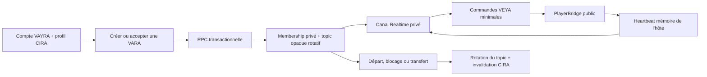

# VARA distante + VEYA — Architecture de production

Dernière mise à jour : 13 juillet 2026. Cette architecture remplace le prototype
IPC local documenté auparavant. Le broker local reste présent pour compatibilité
et tests, mais une VARA authentifiée utilise désormais Supabase Realtime.

## Périmètre et invariants

- VARA est une room privée, temporaire et non publique.
- VEYA ne transporte que l’intention `play`, `pause`, `seek` et un état de
  position minimal.
- Chaque membre ouvre sa source localement. Aucun titre, URL, addon, historique,
  bibliothèque, IP, appareil ou octet vidéo n’est enregistré dans une table VARA
  ou envoyé sur le canal VEYA.
- Le player, libmpv, HDR, shaders, cast, P2P et Stremio ne sont pas modifiés.
- Une session Together historique et une VARA distante ne pilotent jamais le
  lecteur en même temps. Le cast conserve son chemin existant et suspend VEYA.

## Cycle de vie

Le topic `vara:<32 hex>` n’est jamais placé dans le stockage local. Il est
retourné uniquement aux membres par `vara_get_room`, puis remplacé lors des
changements de frontière : admission, départ, blocage et changement d’hôte.

## Modèle Supabase

Les migrations sont :

- `supabase/migrations/20260713290000_vara_remote_rooms.sql`
- `supabase/migrations/20260713300000_vara_remote_invites.sql`

Tables :

- `vara_rooms` : propriétaire, hôte, topic opaque, epoch, lease, capacité et
  expiration ; aucune donnée média.
- `vara_room_members` : adhésion explicite et auteur de l’invitation.
- `vara_room_invites` : invitation directe entre relations CIRA acceptées.
- `vara_room_links` : uniquement le hash du secret, expiration, limite et
  compteur d’usage. Le secret en clair n’est retourné qu’une fois.

Toutes les tables ont RLS activée et aucun accès direct n’est accordé à `anon`.
Les mutations passent par des RPC `security definer` qui appellent la garde CIRA
authentifiée et bêta. Les liens sont opaques, à durée maximale d’une heure et à
usage limité. Leur route publique place le secret dans le fragment URL, le retire
immédiatement de l’historique du navigateur, puis ouvre
`vayra://vara/invite#t=…`.

## Autorisation Realtime

Les policies de `realtime.messages` autorisent :

- présence et `cmd`/`snapshot-request` pour tout membre courant ;
- `state`/`snapshot` uniquement pour l’utilisateur qui détient le lease hôte.

Le client ouvre le canal avec `private: true`. Comme Supabase met l’autorisation
en cache pendant la connexion, toute révocation de membership fait tourner le
topic. La console Realtime doit conserver **Allow public access désactivé** avant
une bêta distante.

## Transport et réconciliation

`src/lib/together/sync/websocket-transport.ts` implémente `SyncTransport` avec :

- reconnexion exponentielle bornée ;
- présence filtrée par le roster CIRA signé par la base ;
- sélection déterministe d’un appareil d’autorité si l’hôte est connecté sur
  plusieurs appareils ;
- lease hôte de 90 secondes, renouvellement et reprise automatique ;
- révisions `hostEpoch * 1_000_000 + seq` monotones ;
- snapshot tardif gardé uniquement en mémoire par l’hôte.

`src/views/player/hooks/use-veya-sync.ts` applique les commandes via la surface
publique `PlayerBridge`. Une origine, un identifiant de corrélation et une fenêtre
de suppression empêchent les boucles. La dérive est ignorée sous 0,75 s,
corrigée doucement entre 0,75 s et 2 s, puis par seek au-delà. Une autorité
publie un heartbeat toutes les trois secondes.

## Interface

La carte VARA de CIRA permet : création, sélection, départ ou fermeture,
invitations directes, invitation HTTPS courte, acceptation/refus/annulation,
révocation de liens et transfert d’hôte. Le player affiche un pill monochrome
VEYA avec rôle et nombre de membres. Les chaînes existent dans les sept locales.

## Validation

- Tests SQL jetables : `bash scripts/cira/db-test.sh`.
- Tests frontend : `pnpm test`.
- Build : `pnpm build`.
- Recette distante transactionnelle :
  `supabase db query --linked --file scripts/vara/remote-smoke.sql`.
- Une recette manuelle à deux appareils reste obligatoire pour confirmer la
  lecture réelle, le join tardif et la dérive. Elle ne doit modifier ni moteur
  vidéo ni source.
