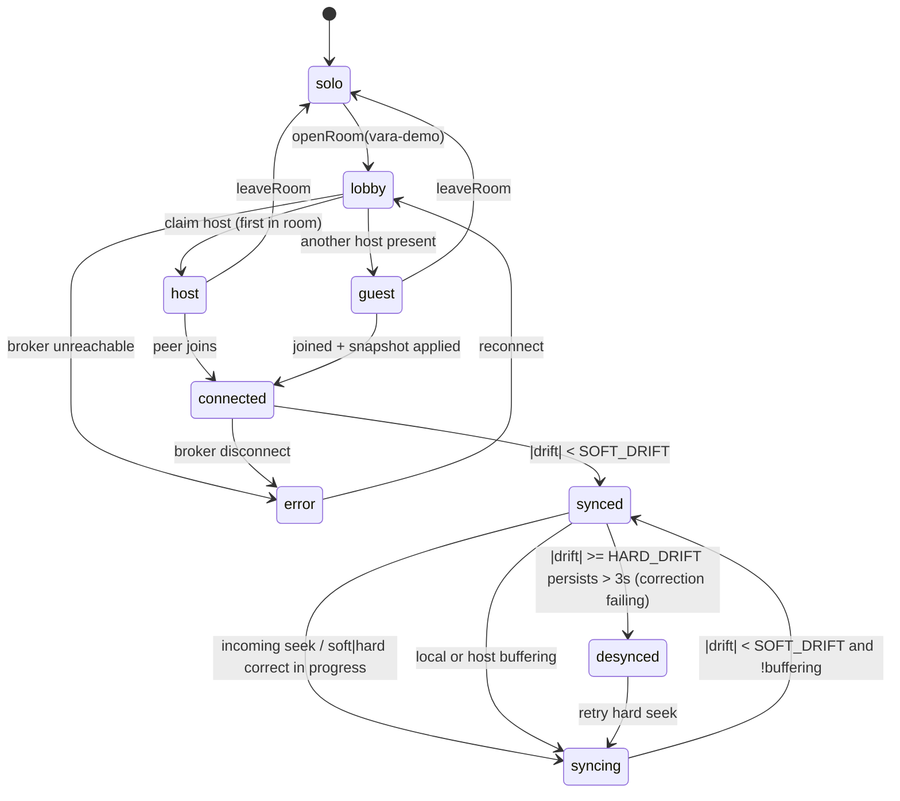

# VARA + VEYA — Architecture d'un prototype local (design)

> **Statut : design / recherche uniquement.** Ce document ne modifie aucun
> comportement. Aucune implémentation n'est faite tant qu'un accord explicite
> n'est pas donné. Produit par une passe d'inspection *read-only* du code réel.

## Définitions produit

- **VARA** : une room privée de visionnage.
- **VEYA** : la synchronisation d'état de lecture entre participants.
- Le prototype n'inclut **ni** compte, auth, serveur cloud, invitation, chat,
  base de données, **ni** partage vidéo. Chaque instance lit **localement sa
  propre source** ; seule **l'intention de lecture** est synchronisée.

## Objectif d'acceptation

Deux instances desktop VAYRA rejoignent une room fixe `vara-demo`. L'hôte fait
play / pause / seek ; le second client s'aligne. Une commande distante appliquée
au player **ne doit jamais** reboucler comme une nouvelle commande locale. Un
client qui rejoint après le démarrage reçoit l'état courant. **La lecture solo
continue à fonctionner strictement comme avant.**

---

## 1. Cartographie (fichiers & symboles réels)

### 1.1 Player — points d'exposition
Backends unifiés derrière `PlayerBridge` (mpv desktop, HTML5 web, ExoPlayer Android).

| Capacité | Symbole / fichier | Nature |
|---|---|---|
| play / pause | `bridge.play/pause` — `src/lib/player/mpv.ts:426-431`, `html5/bridge.ts:459-461`, `exo/bridge.ts:401-406` | impératif (`mpv_set_property pause`) |
| seek | `bridge.seek(sec)` — `mpv.ts:432-437`, `html5/bridge.ts:469-483`, `exo/bridge.ts:407-414` | impératif (`mpv_command seek … absolute exact`) |
| position (observable) | `PlayerSnapshot.positionSec` — `bridge.ts:28-52`, `mpv.ts:147-233` ; store `playback-clock.ts:8-20` | valeur observée (event `time-pos`) |
| buffering (observable) | `PlayerSnapshot.buffering/bufferedSec` — `mpv.ts:218` (`demuxer-cache-duration`) | valeur observée |
| source courante | `load(PlayerSource)` — `mpv.ts:281-425` (`mpv_start`) | impératif |
| fin de lecture | `end-file`/`eof` — `mpv.ts:234-245` ; html5 `ended`; exo `state.ended` | event → `status="ended"` |
| changement de source | `file-loaded`/`loadedmetadata` — `mpv.ts:246-251`, `html5/bridge.ts:211-219` | event |
| souscription | `bridge.subscribe(listener)` — `bridge.ts:107`, `mpv.ts:576-582` | flux d'état sortant |

**Seams retenus** : injection sortante à `RoomCommandSender.send` (`src/lib/together/seek-coalesce.ts:73-88`) ; observation/anti-loop à `bridge.subscribe` (`src/views/player/hooks/use-player-bridge.ts:113-119`).

### 1.2 Stores / hooks pilotant le player
Actions UI → `use-playback-controls.ts:65-111` → `bridge.play/pause/seek`. État hors React via `useSyncExternalStore`/refs + interpolation de position (`cast-interp.ts:1-131`, `exo/bridge.ts` ticker 250ms). Store central `playback-clock.ts`.

### 1.3 Together / relay existant (inspiration, NON réutilisé tel quel)
`src/lib/together/*` (`protocol.ts:3-51`, `client.ts`, `seek-coalesce.ts`), `src/views/player/hooks/use-room-sync.ts`, `waiting-for-room.tsx`, relay `wss://pub.harbor.site` (`relay-version.ts`). Architecture **WebSocket + serveur relais** avec rooms/participants/`SyncState`. **~60-70 %** du provider/protocole est transport-agnostique et réutilisable ; à remplacer : wire WebSocket, clock-offset/ping-pong, retry exponentiel, diagnostic d'erreur terminal.

### 1.4 Conventions du dépôt
- **State** : stores modules + `useSyncExternalStore`/refs (pas de Redux).
- **Tests** : **Vitest**, `*.test.ts` env node (`vitest.config.ts`).
- **IPC** : commandes `vayra_*` (`invoke`) + events `vayra://*` / `vayra:*` (`emit`/`listen`), enregistrées dans `generate_handler!` (`lib.rs:645-781`).
- **Précédent IPC cross-process** : `src-tauri/src/multiview.rs:69-78,395-440` (socket/named-pipe + boucle de retry) — modèle direct pour le broker.

### 1.5 Contexte multi-instance
`tauri_plugin_single_instance::init(...)` (`src-tauri/src/lib.rs:469-481`, plugin v2 `Cargo.toml:45`) force **un seul process** par identifiant `app.vayra`. Conséquence directe sur le transport (§2) et le lancement (§8).

---

## 2. Décision de transport local

**✅ Retenu : broker IPC côté Rust** — `src-tauri/src/playback_sync.rs` (nouveau), socket loopback / named-pipe, calqué sur `multiview.rs`. Raison décisive : single-instance force des **process séparés** et les events Tauri **ne traversent pas** les process.

| Option | Verdict |
|---|---|
| In-memory mock | ❌ intra-process seulement |
| BroadcastChannel | ❌ un seul renderer, ne franchit pas la frontière de process |
| WebSocket loopback (une instance héberge) | ⚠️ marche mais réinvente le broker, moins idiomatique Tauri |
| **Rust IPC broker (tokio mpsc + socket)** | ✅ natif, ordonné, host/guest testable, **remplaçable par WebSocket** (changer seulement le handler de connexion) |
| Fichier/socket sans runtime | ❌ polling, ordre non garanti (Windows), sémantique de lock complexe |

---

## 3. Contrat de synchronisation
Prototype goal: two desktop instances join a fixed room (`vara-demo`); host issues play/pause/seek; guests align; no event loop; late joiner receives current state; **solo playback path is byte-for-byte unchanged**. Each instance plays its own local source — only *intent* (play/pause/seek/position) crosses the wire, never media.

Transport decision (from maps): local sync runs over a **Rust-side IPC broker** (`src-tauri/src/playback_sync.rs`, new) modeled on the cross-process socket pattern in `multiview.rs:69-78,395-440`, because `tauri-plugin-single-instance` (`lib.rs:469-481`) forces separate OS processes and Tauri events do not cross processes. The frontend keeps the existing `TogetherProvider` API surface (`onIncomingCommand`, `onIncomingState`, `publishState`, `sendCommand`) so 60-70% of `src/lib/together/*` is reused; only the wire under `TogetherClient` is swapped from WebSocket to a local `vayra_sync_*` invoke/`vayra://sync-*` event pair.

---

### 3.1 Flow diagram (local / host / guest)

```mermaid
flowchart TB
  subgraph HOST["Instance A — HOST"]
    HUI[UI action: play/pause/seek]
    HCTL["usePlaybackControls\nuse-playback-controls.ts:65-111"]
    HBRIDGE["PlayerBridge (mpv/html5/exo)\nbridge.ts:70-109"]
    HSUB["bridge.subscribe listener\nuse-player-bridge.ts:113-119"]
    HCLOCK["playback-clock store\nplayback-clock.ts:8-20"]
    HRS["useRoomSync.publishState\nuse-room-sync.ts:98-125"]
    HSEND["RoomCommandSender.send\nseek-coalesce.ts:73-88"]
  end

  subgraph BROKER["Rust broker (new)\nplayback_sync.rs"]
    BR["accept_loop + fan-out\n(rev-ordered, echo-suppressed)"]
    SNAP["last SyncState per room\n(for late join)"]
  end

  subgraph GUEST["Instance B — GUEST"]
    GIN["onIncomingCommand / onIncomingState\nuse-room-sync.ts:143-188"]
    GAPPLY["apply with origin=remote\n(reconciler)"]
    GBRIDGE["PlayerBridge.play/pause/seek\nmpv.ts:426-437"]
    GSUB["bridge.subscribe listener\n(origin=remote -> suppress re-send)"]
  end

  HUI --> HCTL
  HCTL -->|host: local intent| HBRIDGE
  HCTL -->|command w/ origin=local + corrId| HSEND
  HBRIDGE --> HSUB --> HCLOCK --> HRS
  HSEND -->|vayra_sync_send cmd| BR
  HRS -->|vayra_sync_publish state| BR
  BR --> SNAP
  BR -->|vayra://sync-cmd fan-out| GIN
  BR -->|vayra://sync-state heartbeat| GIN
  GIN --> GAPPLY -->|origin=remote| GBRIDGE
  GBRIDGE --> GSUB
  GSUB -.->|origin==remote -> DROP (anti-loop)| GSEND[["would re-send: SUPPRESSED"]]

  GJOIN["Guest joins late\nvayra_sync_join(room)"] -->|request snapshot| BR
  BR -->|SNAP -> vayra://sync-state| GIN
```

Solo path: when not in a room, `usePlaybackControls` calls `bridgeRef.current?.play/pause/seek` directly (`use-playback-controls.ts:65-97`) and never touches the sender — identical to today.

---

### 3.2 TypeScript types (minimal, grounded in the player API)

Field names mirror `PlayerSnapshot` (`bridge.ts:28-52`) and `SyncState`/`RoomCommand` (`protocol.ts:33-51`).

```ts
// Fixed local room, no codes needed for the demo; keep the 6-char shape reusable.
export type RoomId = string; // e.g. "vara-demo"

// Where an applied action came from — the anti-loop discriminator.
export type SyncOrigin = "local" | "remote";

// Monotone identity for a single logical intent, survives coalescing.
export interface CorrId {
  member: string; // clientId (localStorage "harbor.together.clientId")
  seq: number;    // per-member monotone counter
}

// Grounded in PlayerSnapshot.status/positionSec/rate (bridge.ts:28-52)
// and SyncState (protocol.ts:33-46). Position-only intent, no media bytes.
export interface PlaybackState {
  rev: number;                 // monotone room revision (see §3)
  playing: boolean;            // snap.status === "playing"
  positionSec: number;         // snap.positionSec at anchorAtMs
  rate: number;                // snap.rate
  buffering: boolean;          // snap.buffering
  ended: boolean;              // snap.status === "ended"
  anchorAtMs: number;          // Date.now() when positionSec sampled (for extrapolation)
  updatedBy: string;           // clientId of author (host) — like SyncState.updatedBy
  hostClientId: string;        // authority holder
}

// Grounded in RoomCommand (protocol.ts:48-51). Adds origin + corrId + rev.
export type PlaybackCommand =
  | { action: "play";  origin: SyncOrigin; corr: CorrId; rev: number; atMs: number }
  | { action: "pause"; origin: SyncOrigin; corr: CorrId; rev: number; atMs: number }
  | { action: "seek";  origin: SyncOrigin; corr: CorrId; rev: number; atMs: number;
      positionSeconds: number };

// Minimal member model (subset of Participant, protocol.ts:3-10).
export interface RoomMember {
  clientId: string;
  name: string;
  isHost: boolean;
  joinedAtMs: number;
}
```

The wire never carries a `PlayerSource`/URL — `load()` (`mpv.ts:281-425`) is strictly local. Only `PlaybackState`/`PlaybackCommand` cross the broker.

---

### 3.3 Monotone revision strategy

Single authority (host) owns a monotone `rev` counter; ordering is total and gap-tolerant.

- **Host owns `rev`.** Every host-originated command increments `rev` (`rev = ++hostRev`) before `RoomCommandSender.send` (`seek-coalesce.ts:73-88`). `publishState` heartbeats (`use-room-sync.ts:98-125`) carry the current `rev`.
- **Guests are last-writer-wins by `rev`.** A guest applies an incoming command/state only if `incoming.rev > appliedRev`; otherwise it is dropped. This replaces the WebSocket `updatedAt`/RTT-offset clock logic (`client.ts:586-610`), which is unneeded in-process.
- **Seek coalescing preserves the highest `rev`.** The existing coalescer (`SEEK_COALESCE_MS = 250`, `seek-coalesce.ts:1-89`) already collapses rapid seeks; here it keeps the newest `seq`/`rev`, so a dropped intermediate seek never regresses ordering.
- **Broker retains only the latest `PlaybackState`** per room (`SNAP`), stamped with the max `rev` seen, so late joiners (§5) fetch a single monotone snapshot.
- **`atMs` (author wall clock) is advisory only** for position extrapolation; ordering never depends on clocks, only on `rev`. Same-machine clocks make `atMs` reliable, but correctness does not require it.

Guest invariant: `appliedRev` is non-decreasing. Any message with `rev <= appliedRev` is a no-op.

---

### 3.4 Anti-loop strategy (origin + correlation id)

The loop risk: a remote command is applied to the guest's `PlayerBridge`, the bridge emits a state change through `bridge.subscribe` (`use-player-bridge.ts:113-119`), and the room-sync layer re-serializes that as a *new* local command back to the broker → infinite echo.

**Two independent guards:**

**(a) Origin tag threaded through the bridge seam.**
The seam is `bridge.subscribe(listener)` in `usePlayerBridge` (`use-player-bridge.ts:113-119`) — the single point where every `PlayerSnapshot` mutation surfaces (`mpv.ts:576-582`, `html5/bridge.ts:732-738`, `exo/bridge.ts:533-539`). Before applying a remote command, the reconciler sets a ref `applyingOrigin.current = "remote"` and a short `suppressUntilMs` window. When the subscribe listener fires as a *consequence* of that apply, room-sync checks the ref: if `origin === "remote"`, it updates the `playback-clock` store (`playback-clock.ts:8-20`) for display but **does not** call `RoomCommandSender.send`. Only `origin === "local"` (genuine UI action via `use-playback-controls.ts:65-111`) is forwarded. This is the exact injection seam recommended in the transport map: intercept at `RoomCommandSender.send` (`seek-coalesce.ts:77-84`), gated by origin.

**(b) Correlation-id echo suppression at the broker.**
Each command carries `corr = { member, seq }`. The broker fans out to **all peers except the author** (`emit_to` every connection whose `clientId !== corr.member`), mirroring "broadcast to all OTHER instances." Additionally each instance keeps a small LRU of recently-applied `corr` keys; a command whose `corr` was already applied is ignored. This defends against the case where origin state is momentarily wrong (e.g. a race between apply and the debounced seek flush at `use-room-sync.ts:184`).

Combined rule the guest applies:
```
apply(cmd) iff  cmd.origin === "remote"
             && cmd.rev > appliedRev
             && !recentCorr.has(cmd.corr)
```
and never re-emits while `applyingOrigin.current === "remote"` or `now < suppressUntilMs` (suppress window `= 400ms`, covering seek debounce `SEEK_APPLY_DEBOUNCE_MS` + coalesce `250ms`).

---

### 3.5 Position-reconciliation algorithm

Runs on the guest each time an incoming `state`/`command` is applied and on a 1 Hz tick, reading local position from `playback-clock` (`playback-clock.ts:8-20`) / `snap.positionSec`.

**Target position (extrapolated authority):**
```
target = state.positionSec
       + (state.playing ? (Date.now() - state.anchorAtMs)/1000 * state.rate : 0)
drift  = localPositionSec - target
```

**Thresholds / heuristics:**
- `SOFT_DRIFT = 0.75s`, `HARD_DRIFT = 2.0s`.
- `|drift| < SOFT_DRIFT` → **synced**, do nothing (avoids seek churn; below human-perceptible A/V slip).
- `SOFT_DRIFT ≤ |drift| < HARD_DRIFT` → **soft correct**: nudge `setRate` (`mpv.ts:447-451`) to `state.rate * (drift > 0 ? 0.95 : 1.05)` for ~1s, then restore. If the engine can't rate-nudge cleanly, fall through to hard.
- `|drift| ≥ HARD_DRIFT` → **hard correct**: `bridge.seek(target)` (`mpv.ts:432-437`) with `origin=remote`, state → **syncing** until next tick shows `|drift| < SOFT_DRIFT`.

**Buffering:** if local `snap.buffering` (`bridge.ts` buffering, `mpv.ts:218` demuxer-cache) is true, **suspend** correction and never seek; mark **syncing**. If the *host* is buffering (`state.buffering`), guests freeze target advancement (treat as `playing=false` for extrapolation) so they don't run ahead of a stalled host.

**Late join:** on `vayra_sync_join`, broker replies with `SNAP`. Guest performs an unconditional hard `seek(target)` and sets `playing` to match `state.playing` via `bridge.play/pause` (`mpv.ts:426-431`), bypassing `SOFT_DRIFT`. This satisfies "late joiner gets current state."

**End-of-media:** local `status === "ended"` (`mpv.ts:234-245` end-file eof / `html5 ended` / `exo state.ended`) sets `PlaybackState.ended=true`. Reconciler never seeks past `durationSec`; if `target > localDuration - 0.25s`, clamp and hold paused. A guest whose own source is shorter simply ends and stops reconciling forward (sources are independent by design).

**Source-change:** purely local (`load()`, `mpv.ts:281-425`); not synced. After a local source change the guest resets `anchorAtMs` handling by re-running late-join reconciliation against the last `state` (re-seek to `target`) once `file-loaded`/`loadedmetadata` fires (`mpv.ts:246-251`, `html5/bridge.ts:211-219`).

---

### 3.6 Minimal UI states + transitions



- **solo**: no room; direct bridge control; byte-for-byte unchanged path.
- **lobby**: joined room id, no peer / authority yet (mirrors `WaitingForRoom`/`startRoom`, `client.ts:213-232`).
- **host / guest**: role from first-claim (host asymmetry, `updatedBy`/`hostClientId`).
- **connected**: ≥2 members; **synced/syncing/desynced** are the reconciler sub-states from §5.
- **error**: broker unreachable (Rust `vayra_sync_join` invoke rejects) — log to console, offer reconnect; never blocks solo playback.

---

### 3.7 Edge cases + test matrix

**Edge cases**
- Simultaneous host+guest seek → `rev` LWW; lower `rev` dropped (§3).
- Remote apply echo → suppressed by origin ref + `corr` LRU (§4).
- Guest joins mid-seek → snapshot has newest `rev`; unconditional re-seek (§5 late join).
- Host source is longer/shorter than guest's → independent EOM, no forward reconcile past local duration (§5).
- Buffering on either side → correction suspended, state=syncing (§5).
- Broker dies mid-session → guests fall back to solo control, UI=error; no loop, no crash.
- Rapid play/pause toggling → coalescer + `rev` monotonicity prevent flip-flop; `SEEK_COALESCE_MS=250`.
- Clock skew between machines → ordering is `rev`-based, not clock-based; only extrapolation uses `atMs`.

**Test matrix**

| Layer | Test | Where | Assert |
|---|---|---|---|
| Pure logic (Vitest, node env `vitest.config.ts`) | rev LWW: drop `rev <= appliedRev` | new `src/lib/together/reconcile.test.ts` | monotone apply only |
| Pure logic | drift buckets: none/soft/hard | reconcile.test.ts | correct action per §5 thresholds |
| Pure logic | anti-loop: remote-origin snapshot never produces send | new `sync-origin.test.ts` | `send` not called when origin=remote |
| Pure logic | corr LRU dedup | sync-origin.test.ts | duplicate `corr` ignored |
| Pure logic | coalescer keeps highest rev/seq | extend `cast-interp`-style test near `seek-coalesce.ts` | newest survives |
| Bridge (mock) | remote seek → `bridge.seek(target)` once, no re-emit | mock `PlayerBridge` (`bridge.ts:70-109`) | one seek call, zero forwarded commands |
| Broker (Rust) | fan-out excludes author `corr.member` | `playback_sync.rs` unit | author not echoed |
| Broker (Rust) | late-join returns latest `SNAP` | `playback_sync.rs` unit | snapshot == max rev |
| Integration | two instances, host play/pause/seek, guest aligns | manual + scripted `vara-demo` | guest drift < SOFT_DRIFT, no loop |
| Integration | late joiner alignment | manual | joiner within HARD_DRIFT then synced |
| Regression | solo path unchanged | run without room | no `vayra_sync_*` invoked; identical to baseline |

**Acceptance mapping:** two instances / fixed `vara-demo` → §1 flow + broker join; host authority + guest align → §3 rev + §5 reconcile; no loop → §4 origin+corr at `use-player-bridge.ts:113` / `seek-coalesce.ts:77-84`; late join → §5 snapshot; solo unchanged → §6 solo state bypasses sender entirely.

#### Critical Files for Implementation
- src/views/player/hooks/use-room-sync.ts
- src/lib/together/seek-coalesce.ts
- src/views/player/hooks/use-player-bridge.ts
- src/lib/together/protocol.ts
- src-tauri/src/playback_sync.rs (new, modeled on src-tauri/src/multiview.rs)

---

## 4. Plan de PRs (atomiques)
Five atomic PRs. Each is independently mergeable, never breaks solo playback, and touches the player core (mpv/cast/html5/exo/Stremio) not at all. The transport is defined behind an interface in PR 1 so the local broker can later be swapped for a real WebSocket relay with zero changes above the seam.

Ordering rationale: define the replaceable transport contract + pure logic first (no runtime wiring, cannot affect solo), then the Rust broker (dormant until called), then the frontend client that binds the contract to the broker, then the reconciler wiring at the bridge/sender seams (gated so solo is bypassed), then the minimal UI/roles. At every step, absent a room, the solo code path is byte-for-byte unchanged.

---

### PR 1 — Sync contract: transport interface + protocol types + pure logic

**Single responsibility:** Define the replaceable transport abstraction and all pure, side-effect-free sync logic (types, rev ordering, drift bucketing, anti-loop predicate, coalescer rev-preservation). No runtime, no IPC, no wiring.

**Files / areas touched (new, additive only):**
- `src/lib/together/sync/transport.ts` (new) — `SyncTransport` interface: `publishState(state)`, `sendCommand(cmd)`, `join(room)`, `onState(cb)`, `onCommand(cb)`, `onSnapshot(cb)`, `close()`. This is the single seam a WebSocket relay must later implement.
- `src/lib/together/sync/types.ts` (new) — `RoomId`, `SyncOrigin`, `CorrId`, `PlaybackState`, `PlaybackCommand`, `RoomMember` (field names mirror `PlayerSnapshot` in `src/lib/player/bridge.ts:28-52` and `SyncState`/`RoomCommand` in `src/lib/together/protocol.ts:33-51`).
- `src/lib/together/sync/reconcile.ts` (new) — pure functions: `nextRev`, `shouldApply(incomingRev, appliedRev)` (rev LWW, §3), `driftAction(local, target, thresholds, buffering)` returning `none | soft | hard | suspend` (§5), `extrapolateTarget(state, nowMs)`.
- `src/lib/together/sync/anti-loop.ts` (new) — pure `shouldForward(origin, applyingOrigin, nowMs, suppressUntilMs)` and a `CorrLru` (fixed-size recently-applied `corr` set).
- `src/lib/together/seek-coalesce.ts` (touched, additive) — extend coalescer to carry/preserve the highest `rev`/`seq` when collapsing seeks; existing behavior unchanged when `rev` absent.

**Acceptance criteria:**
- `SyncTransport` interface compiles and is imported by no runtime code yet (contract only).
- No existing file's runtime behavior changes; `seek-coalesce.ts` change is backward-compatible (no `rev` ⇒ identical output to today).
- Pure functions have zero imports from `player/`, `tauri`, or DOM.

**Tests added (Vitest, node env per `vitest.config.ts`):**
- `src/lib/together/sync/reconcile.test.ts` — rev LWW drops `rev <= appliedRev`; drift buckets none/soft/hard/suspend at 0.75s / 2.0s thresholds; buffering ⇒ suspend; extrapolation with `playing`/`rate`.
- `src/lib/together/sync/anti-loop.test.ts` — remote-origin never forwards; `CorrLru` dedups; suppress window honored.
- `src/lib/together/seek-coalesce.test.ts` (extend) — collapsing seeks preserves highest `rev`/`seq`; no-`rev` path unchanged.

**Risks:** Low. Pure additive module; only real coupling risk is the `seek-coalesce.ts` edit — mitigated by keeping the `rev`-less path byte-identical and asserting it in tests.

---

### PR 2 — Rust IPC broker (`playback_sync.rs`), dormant until invoked

**Single responsibility:** Add a local cross-process broker that fans out commands/state between separate OS instances and retains the latest snapshot for late join. Registered but inert unless `vayra_sync_*` is called.

**Files / areas touched:**
- `src-tauri/src/playback_sync.rs` (new) — modeled on the cross-process socket pattern in `src-tauri/src/multiview.rs:69-78,395-440` (Unix socket / Windows named-pipe, tokio, retry loop). Struct holds per-connection senders keyed by `clientId` and a `last SyncState per room`. Fan-out excludes the author (`corr.member`). Emits to peers via `vayra://sync-cmd` / `vayra://sync-state`; join returns the retained snapshot.
- `src-tauri/src/lib.rs` (touched) — register commands `vayra_sync_join`, `vayra_sync_send`, `vayra_sync_publish`, `vayra_sync_leave` in `generate_handler!` (`src-tauri/src/lib.rs:645-781`) and manage broker state (`Arc<Mutex<…>>` pattern per `pip.rs:49-63`). No startup side effects beyond binding the loopback listener.

**Acceptance criteria:**
- Building the app with no room activity is behaviorally identical to `main`; broker only does work once a client calls `vayra_sync_join`.
- Fan-out never echoes to the authoring `clientId`.
- `vayra_sync_join` returns the latest retained `SyncState` (max `rev`) for the room, or empty if none.
- Naming follows `vayra_*` command / `vayra://` event conventions (per maps).

**Tests added (Rust `#[cfg(test)]` unit tests in `playback_sync.rs`):**
- Fan-out excludes author `corr.member`.
- Late-join returns snapshot with max `rev`.
- Two in-process mock connections: send from A is received by B, not A.

**Risks:** Medium. Platform socket differences (named-pipe vs Unix socket) — mitigated by reusing the proven `multiview.rs` connect/retry code. Port/pipe discovery across two independent processes is the main open question (see Blocking Questions).

---

### PR 3 — Local `SyncTransport` implementation over the broker

**Single responsibility:** Implement the PR 1 `SyncTransport` interface against the PR 2 broker via `invoke`/`listen`. This is the only file that knows the transport is local rather than a relay.

**Files / areas touched:**
- `src/lib/together/sync/local-transport.ts` (new) — implements `SyncTransport`: `join`→`invoke('vayra_sync_join')`, `sendCommand`→`invoke('vayra_sync_send')`, `publishState`→`invoke('vayra_sync_publish')`; `onCommand`/`onState`/`onSnapshot`→`listen('vayra://sync-cmd' | 'vayra://sync-state')`. `clientId` sourced from the existing `localStorage` key `harbor.together.clientId` (per `client.ts` findings).
- No change to `TogetherClient`/`provider.tsx` in this PR — the local transport stands alone and is exercised by tests + a thin manual harness only.

**Acceptance criteria:**
- `LocalTransport` satisfies `SyncTransport` structurally (type-checked).
- Round-trip: `sendCommand` on instance A surfaces via `onCommand` on instance B and never on A.
- `join` resolves with the retained snapshot or null.
- Swapping in a future `WebSocketTransport` requires implementing only this interface (no consumer changes) — demonstrated by a mock transport passing the same test suite.

**Tests added:**
- `src/lib/together/sync/local-transport.test.ts` — mock `@tauri-apps/api` `invoke`/`listen`; assert command/state serialization matches PR 1 types, listener registration/teardown, and author-echo suppression at the JS boundary.
- Shared `SyncTransport` conformance test run against both a `FakeTransport` and `LocalTransport` (proves replaceability).

**Risks:** Low–medium. Serialization mismatch between JS types and Rust structs — mitigated by the conformance test and shared type field names. No solo-path exposure (nothing imports this yet outside tests).

---

### PR 4 — Reconciler wiring at bridge + sender seams (room-gated, solo bypassed)

**Single responsibility:** Connect incoming remote intent to `PlayerBridge` and gate outgoing local intent, with the anti-loop guards live. Everything is behind an `inRoom` gate so the solo path is untouched.

**Files / areas touched:**
- `src/views/player/hooks/use-room-sync.ts` (touched) — in the remote-apply path (`use-room-sync.ts:143-188`), set `applyingOrigin.current="remote"` + `suppressUntilMs` before calling `bridge.play/pause/seek`, run the PR 1 `driftAction`/`extrapolateTarget` reconciliation (soft `setRate` nudge / hard `seek` / suspend on buffering), and apply late-join snapshot unconditionally. Wire `onIncomingState`/`onIncomingCommand` to the PR 3 transport's `onState`/`onCommand`.
- `src/views/player/hooks/use-player-bridge.ts` (touched) — at the `bridge.subscribe` listener (`use-player-bridge.ts:113-119`), read `applyingOrigin`/`suppressUntilMs`; when the emission is a consequence of a remote apply, update `playback-clock` for display but do not forward.
- `src/lib/together/seek-coalesce.ts` seam (`:73-88`) — outgoing forward stamps `origin="local"` + `corr` + host `rev`; forward only when `shouldForward(...)` (PR 1) is true.
- `src/views/player/hooks/use-playback-controls.ts` — **unchanged**; the solo branch (`:65-97`) still calls `bridge.play/pause/seek` directly and never reaches the sender.

**Acceptance criteria:**
- With no room: zero `vayra_sync_*` invocations; playback identical to baseline (regression asserted).
- A remote command applied to the guest bridge produces exactly one bridge call and zero forwarded commands (no echo loop).
- Guest converges to `|drift| < SOFT_DRIFT` after a host seek; buffering suspends correction (no seek while buffering).
- Player core files (mpv/cast/html5/exo/Stremio) are not modified.

**Tests added:**
- `src/views/player/hooks/reconcile-wiring.test.ts` — mock `PlayerBridge` (interface `src/lib/player/bridge.ts:70-109`): remote `seek` ⇒ one `bridge.seek(target)`, zero forwarded commands; remote apply while `applyingOrigin="remote"` never re-sends.
- Regression test: solo controls path invokes no transport method.
- Drift convergence test driving synthetic state ticks through the reconciler + mock bridge.

**Risks:** Medium–high (this is the behavioral core). Echo loops if origin/`corr` guards race the debounced seek flush (`use-room-sync.ts:184`) — mitigated by dual guard (origin ref + `CorrLru`) and a suppress window ≥ `SEEK_APPLY_DEBOUNCE_MS + 250ms`. Rate-nudge soft correction may misbehave on engines that don't rate-adjust cleanly — mitigated by falling through to hard seek.

---

### PR 5 — Minimal room UI + roles (solo / lobby / host / guest / synced / error)

**Single responsibility:** Expose the fixed `vara-demo` room: join/leave, host-vs-guest role claim, and the minimal sync-status states. No new sync logic — pure presentation over PRs 1–4.

**Files / areas touched:**
- `src/views/player/hooks/use-room-sync.ts` (touched) — expose room lifecycle: `openRoom("vara-demo")`/`leaveRoom`, first-in-room claims host (authority for `rev`), others become guest (host asymmetry mirrors `client.ts:213-232` `startRoom`/`claimHost`), and the state machine `solo → lobby → host|guest → connected → synced|syncing|desynced`, plus `error` on broker-unreachable.
- A small status indicator in the existing player controls surface (reusing the player view's control components) — display-only; no change to control callbacks.
- `src/lib/together/sync/types.ts` — `RoomMember` used for the minimal member/role model (no full `Participant` protocol).

**Acceptance criteria:**
- Two instances launched, both `openRoom("vara-demo")`: first is host, second is guest; guest aligns to host (drift < `SOFT_DRIFT`).
- Late joiner receives current state and hard-seeks into alignment.
- `leaveRoom` returns both to solo with unchanged direct-bridge control.
- Broker unreachable ⇒ `error` state shown, solo playback still fully functional (never blocked).

**Tests added:**
- `src/views/player/hooks/room-state-machine.test.ts` — transitions solo↔lobby↔host/guest↔connected↔synced/syncing/desynced and error; host-claim assigns exactly one host.
- Role-claim test: first joiner ⇒ host, second ⇒ guest.

**Risks:** Low–medium. UI-only, but role-claim race if two instances join within the same tick — mitigated by broker-side first-writer-wins on host claim (deterministic single authority).

---

### Overall risk list

1. **Cross-process broker discovery (highest).** Two independent OS processes (single-instance plugin `lib.rs:469-481`) must find the same socket/pipe. `multiview.rs` spawns children and knows the pipe path; here neither instance is a child of the other. Needs a well-known path (fixed pipe name / socket in app-data dir) or a discovery step. See Blocking Question 1.
2. **Echo/oscillation at the reconcile seam (PR 4).** Remote-apply → bridge emit → re-forward loops. Dual guard (origin ref + `CorrLru` + suppress window) is designed for it, but timing vs `SEEK_APPLY_DEBOUNCE_MS` must be tuned; covered by wiring tests.
3. **Soft-correction rate nudge portability.** `setRate` behavior differs per engine (mpv/html5/exo); prototype falls through to hard seek, but rate-based smoothing may be inconsistent. Non-blocking (hard seek always available).
4. **Type/serialization drift between JS `PlaybackState`/`PlaybackCommand` and Rust structs.** Mitigated by shared field names and the transport conformance test (PR 3).
5. **Position extrapolation depends on `atMs` wall clocks.** Ordering is rev-based (safe), but cross-machine clock skew degrades extrapolation smoothness. Acceptable for prototype; correctness unaffected.
6. **Solo-path regression is the one non-negotiable.** Every PR asserts "no room ⇒ no `vayra_sync_*`, identical behavior"; PR 4 carries the explicit regression test.

### Blocking questions (demonstrated by the code)

1. **How do two separate OS instances rendezvous on the broker endpoint?** `tauri-plugin-single-instance` (`src-tauri/src/lib.rs:469-481`) makes secondary launches call back into the first process rather than spawn a peer — so the two-instance demo requires either disabling/scoping single-instance for the prototype, or launching the second instance with a distinct data dir. `multiview.rs` only demonstrates parent→child pipe paths (`multiview.rs:69-78,395-440`), not peer discovery between unrelated instances. **Decision needed before PR 2:** fixed well-known socket/pipe path vs. discovery file in app-data dir, and how the demo launches a second independent instance past the single-instance guard.

2. **Is there an existing non-single-instance launch mode for the demo?** The maps show single-instance is unconditionally registered on desktop. If no bypass exists, PR 5's "two instances" acceptance criterion cannot be met without a code path to launch a second instance (e.g., separate `--user-data-dir`). Confirm whether such a flag/env already exists before wiring PR 5's acceptance test.

Both questions are answerable by reading `src-tauri/src/lib.rs:469-481` and the single-instance registration; they are load-bearing for PR 2 and PR 5 and should be resolved before those PRs start.

---

## 5. Lancement de deux instances (résolution de la question bloquante)

**Décision produit : lancer la 2ᵉ instance avec un data-dir distinct.**

Nuance technique vérifiée sur le code : `tauri_plugin_single_instance` (`lib.rs:469`)
déduplique sur **l'identifiant du bundle `app.vayra`**, pas sur le data-dir. Un
data-dir distinct **seul** ne crée donc pas un 2ᵉ process — le 2ᵉ lancement
rappellerait le 1er via le callback single-instance. La décision est donc
**couplée à un scoping de single-instance** derrière un même flag dev-only.

### Mécanisme retenu
Un flag de lancement **dev-only** (env `VAYRA_DATA_DIR` ou CLI `--user-data-dir=…`)
qui, **uniquement quand il est présent** :
1. **Override `app_data_dir`** → settings / window-state / keyring distincts (aucun conflit entre les 2 instances).
2. **Scope / skip single-instance** → le 2ᵉ process peut vivre.
3. Le **broker écoute sur un chemin de socket/pipe FIXE et partagé** (identité-based, ex. `$TMPDIR/vayra-vara.sock`), **jamais** sous le data-dir — sinon les 2 instances ne se retrouvent pas.

```
Instance A (défaut)                 Instance B (VAYRA_DATA_DIR=/tmp/vayra-b)
  data-dir: app.vayra                 data-dir: /tmp/vayra-b   (distinct)
  single-instance: actif              single-instance: scopé (flag) → 2e process OK
        \                                   /
         └──── socket FIXE $TMPDIR/vayra-vara.sock (broker) ────┘
```

### Garde-fou (frontière avec les interdictions)
Sans le flag : **comportement par défaut strictement inchangé** — un seul process,
single-instance actif, storage / updater / keyring / deep-links intacts en prod.
Le flag est **désactivé par défaut** et réservé au démo. C'est la seule voie pour
honorer « deux instances desktop » sans casser le single-instance de prod.

### Impact sur le plan
- **PR2 (broker)** : socket sur chemin **fixe bien connu** (pas per-data-dir).
- **PR0 (nouveau, petit, desktop-only, gardé par le flag)** : override `app_data_dir`
  + scoping single-instance **seulement si `VAYRA_DATA_DIR` défini**. À faire avant PR2.

---

## 6. État des questions bloquantes

1. **Rendez-vous cross-process du broker** — *résolu* : chemin de socket fixe partagé (§8) + PR0 pour le lancement de la 2ᵉ instance.
2. **Mode de lancement non-single-instance pour le démo** — *résolu* : flag dev-only `VAYRA_DATA_DIR` (§8, PR0).

Aucune autre question bloquante démontrée par le code.

---

*Design complet. En attente d'un accord explicite avant toute implémentation.*
